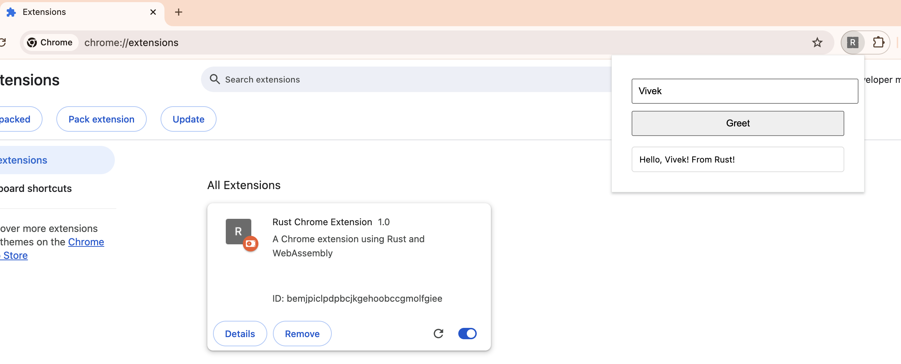

https://dzone.com/articles/build-chrome-extension-rust-webassembly

# Rust Chrome Extension Example

A simple Chrome extension that demonstrates using Rust with WebAssembly.

## Demo



## Setup

1. Install dependencies:

```bash
# Install Rust
curl --proto '=https' --tlsv1.2 -sSf https://sh.rustup.rs | sh

# Install wasm-pack
cargo install wasm-pack
```

2. Build the extension:

```bash
npm run build
```

3. Load in Chrome:

- Open `chrome://extensions`
- Enable Developer mode
- Click "Load unpacked"
- Select the `dist` directory

## Available Scripts

- `npm run clean` - Clean all build outputs
- `npm run build` - Build the extension

## Structure

```bash
rust-chrome-extension/
├── Cargo.toml           # Rust dependencies and build config
├── src/
│   └── lib.rs          # Rust code (WebAssembly source)
├── manifest.json        # Chrome extension manifest
├── popup.html          # Extension popup UI
├── popup.js            # JavaScript code for the popup
└── pkg/                # Generated after build (contains compiled WebAssembly)
    ├── rust_chrome_extension_bg.wasm
    └── rust_chrome_extension.js
```
